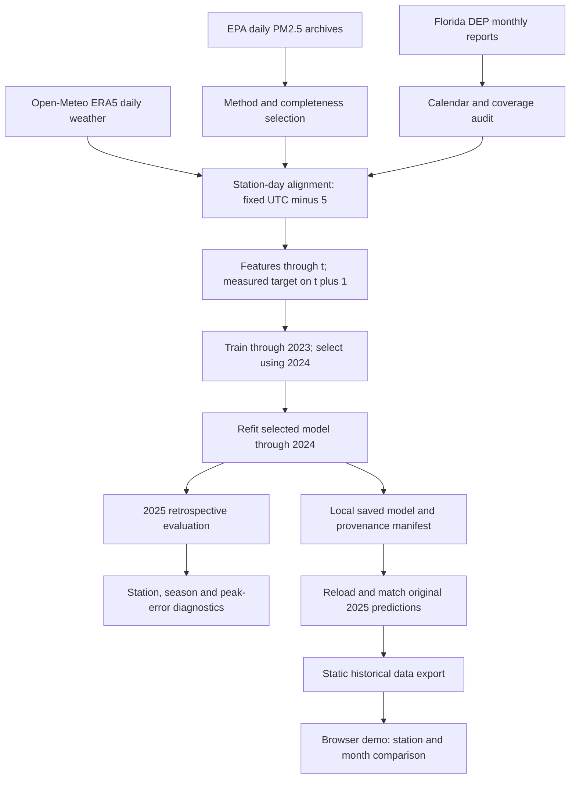

# From public records to a historical prediction

## Boundaries

The DEP reports establish the calendar and a comparison series. Corrected, method-checked EPA observations supply the modeling labels. Neither a missing target nor a gap is filled with a later reading. Model input columns are explicitly listed; target and reference columns never enter the estimator.

Each training period owns its imputer and scaler. The saved model stops training at December 2024; the command rejects requests for training-period dates or dates beyond 2025. Observed outcomes shown by the replay command and demo are comparison values, not estimator inputs.

The browser uses only exported numerical predictions and observations. It does not load a Python model, call weather APIs or generate live forecasts. Missing comparisons stay absent, and chart lines break at calendar gaps.

## Reproducibility layers

| Layer | Checked into Git | Recreated locally |
| --- | --- | --- |
| Sources | Collection code and source documentation | Cached HTML, EPA archives, weather responses and hashes |
| Analysis | Feature/evaluation code and findings | Training examples, metrics and row-level evaluation files |
| Model | Packaging code and model card | Serialized estimator and manifest |
| Demo | HTML, CSS, JavaScript and 1,910 historical comparisons | Export can regenerate its data file |
| Checks | Offline tests and GitHub Actions workflow | Tests run after dependency installation |

GitHub checks use only tracked files and small in-memory test fixtures. They do not download years of source data or retrain the full project. Full reproduction is a separate explicit workflow documented in README.md. The model packaging step checks numerical agreement with the original baseline predictions.

See [data methods](DATA_METHODS.md) for corrections and time alignment, and [the model card](MODEL_CARD.md) for intended use and limitations.
